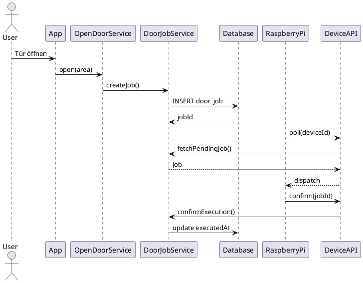
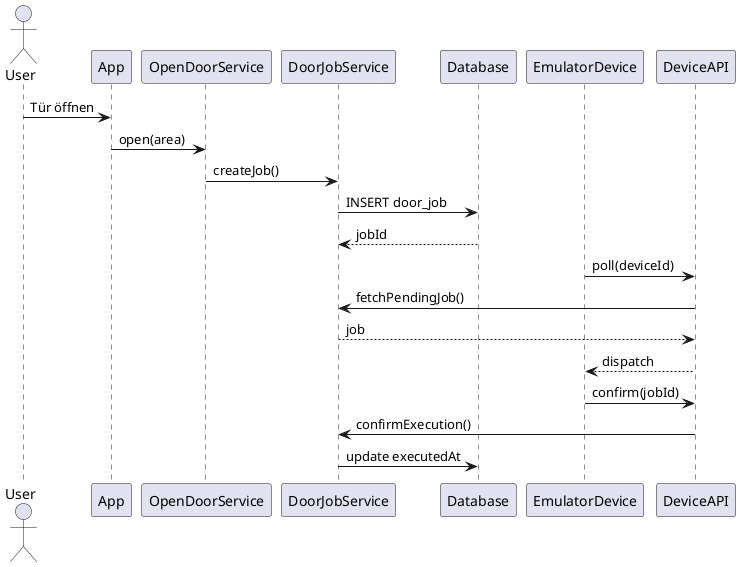

# Door Control Sequence Diagrams
Community Offers Bundle – Door Control Runtime Sequences

Dieses Dokument beschreibt den exakten Ablauf der Türöffnung
für die beiden Betriebsmodi:

- live
- emulator

Die Diagramme sind in **PlantUML** dargestellt.

---

# Live Mode

Produktiver Betrieb mit realer Hardware.

Eigenschaften:

- Job wird erzeugt
- Raspberry Pi pollt
- Job wird dispatcht
- Confirm wird gesendet
- Tür öffnet physisch

## Sequence

---

# Emulator Mode

Workflow-Testmodus ohne reale Hardware.

Eigenschaften:

- identischer Ablauf wie live
- Emulator pollt statt Raspberry Pi
- keine physische Türöffnung

## Sequence

---

# Architekturübersicht

Die drei Modi unterscheiden sich hauptsächlich im **Workflow-Verhalten**.

| Mode | Job | Polling | Confirm | Device |
|-----|-----|--------|--------|-------|
| live | ja | ja | ja | Raspberry Pi |
| emulator | ja | ja | ja | Emulator |

---

# Channel

Zusätzlich wird der Ausführungspfad gespeichert.

| Channel | Beschreibung |
|-------|-------------|
| physical | reale Hardware |
| emulator | Emulator-Device |

---

# Datenmodell

Jobs speichern:

mode  
channel  

Beispiele:

Live:

mode = live  
channel = physical  

Emulator:

mode = emulator  
channel = emulator  
