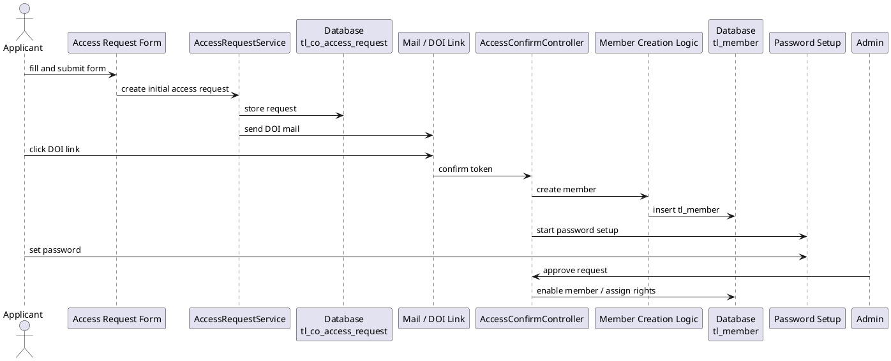
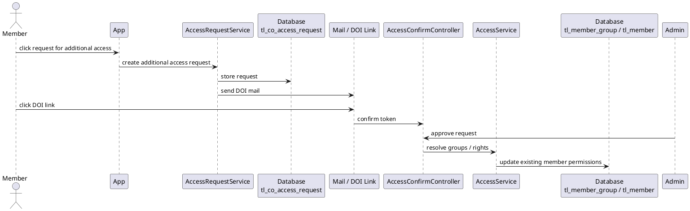

# Access Request Sequence Diagrams

This document visualizes the two distinct access request workflows:

- Initial Access Request
- Additional Access Request

These workflows must remain clearly separated.

---

## 1) Initial Access Request (new member)

---

## 2) Additional Access Request (existing member)

---

## 3) Key Differences

| Aspect | Initial Access Request | Additional Access Request |
|--------|------------------------|---------------------------|
| Existing member required | No | Yes |
| Input source | Form | App click |
| Creates tl_member | Yes | No |
| Password step | Yes | No |
| Result | New member | Additional permissions |
| Admin approval required | Yes | Yes |

---

## 4) Domain Rule

These workflows must never be merged.

Important constraints:

- Initial requests create new members
- Additional requests never create members
- Additional requests never trigger password setup
- Permission updates must target existing members only
