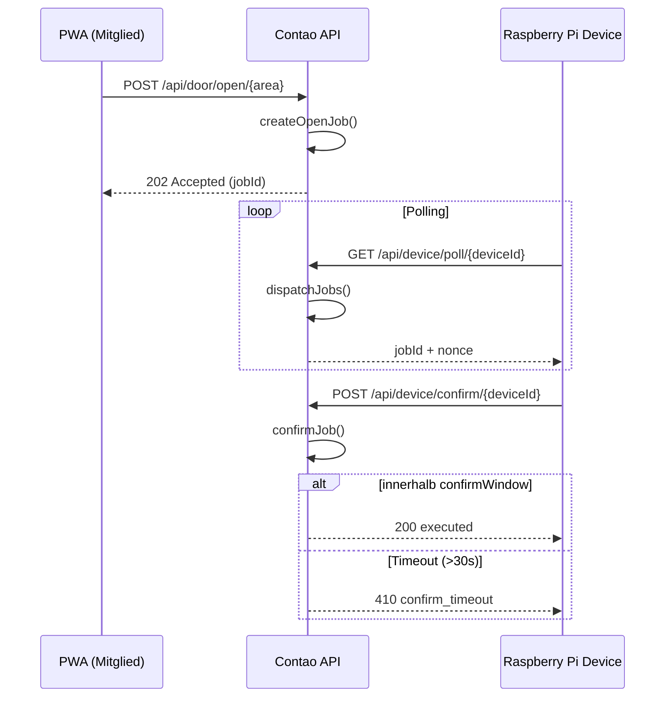

Door API v1 – Zukunftwohnen Zugangssystem
Überblick

Ziel: Ein Frontend-Mitglied (PWA) fordert das Öffnen einer Tür (Area) an.
Ein Raspberry Pi (Device) holt Jobs per Pull (poll), führt die Aktion aus und bestätigt das Ergebnis (confirm).

Statusmodell
Status	Bedeutung
pending	Job wartet auf Abholung durch Device
dispatched	Job wurde einem Device zugewiesen
executed	Erfolgreich ausgeführt
failed	Ausführung fehlgeschlagen
expired	Timeout (pending oder confirm)
Zeitregeln

pending TTL → expiresAt

dispatched TTL → dispatchedAt + confirmWindow

confirmWindow = 30 Sekunden

1) Tür öffnen (PWA)
POST /api/door/open/{area}

Frontend-Mitglied fordert Öffnung an.

Erfolgsantwort

HTTP 202

{
  "success": true,
  "accepted": true,
  "jobId": 123,
  "status": "pending",
  "expiresAt": 1772301885
}

Hinweise:

expiresAt nur relevant bei pending

Bei erneutem Klick kann derselbe aktive Job zurückgegeben werden (Idempotenz)

Fehler

401 – nicht eingeloggt

{ "success": false, "error": "unauthorized" }

404 – unbekannte Area

{ "success": false, "error": "invalid_area" }

429 – RateLimit oder Lock

{
  "success": false,
  "accepted": false,
  "error": "rate_limited",
  "retryAfterSeconds": 12
}
2) Device Poll (Raspberry Pi)
GET /api/device/poll/{deviceId}?areas=a,b

Device fragt Jobs ab.

Keine Jobs

HTTP 200

{
  "success": true,
  "jobs": [],
  "nextPollInMs": 2000
}
Job vorhanden

HTTP 200

{
  "success": true,
  "jobs": [
    {
      "jobId": 123,
      "area": "workshop",
      "nonce": "ba39322f99d812429a0ffa28490f60bf",
      "expiresInMs": 30000
    }
  ],
  "nextPollInMs": 250
}

Hinweis:

expiresInMs = verbleibende Confirm-Zeit

nonce muss beim Confirm wieder gesendet werden

3) Device Confirm
POST /api/device/confirm/{deviceId}
Request
{
  "jobId": 123,
  "nonce": "ba39322f99d812429a0ffa28490f60bf",
  "ok": true,
  "meta": { "durationMs": 420 }
}
Erfolgreich

HTTP 200

{
  "success": true,
  "accepted": true,
  "jobId": 123,
  "status": "executed"
}
Idempotent (bereits final)

HTTP 200

{
  "success": true,
  "accepted": true,
  "jobId": 123,
  "status": "expired"
}
Fehlerfälle

404 – Job existiert nicht

{ "success": false, "accepted": false, "error": "not_found" }

403 – nonce oder device falsch

{ "success": false, "accepted": false, "error": "forbidden" }

409 – Job nicht dispatched

{ "success": false, "accepted": false, "error": "not_dispatchable" }

410 – Confirm zu spät

{
  "success": false,
  "accepted": false,
  "error": "confirm_timeout",
  "status": "expired"
}
E2E Ablauf

Normalfall:

open → 202

poll → jobId + nonce

confirm → 200 executed

Timeout-Test:

poll → job

warten > 30s

confirm → 410 confirm_timeout

DB → status expired + TIMEOUT

# Ablaufdiagramm

