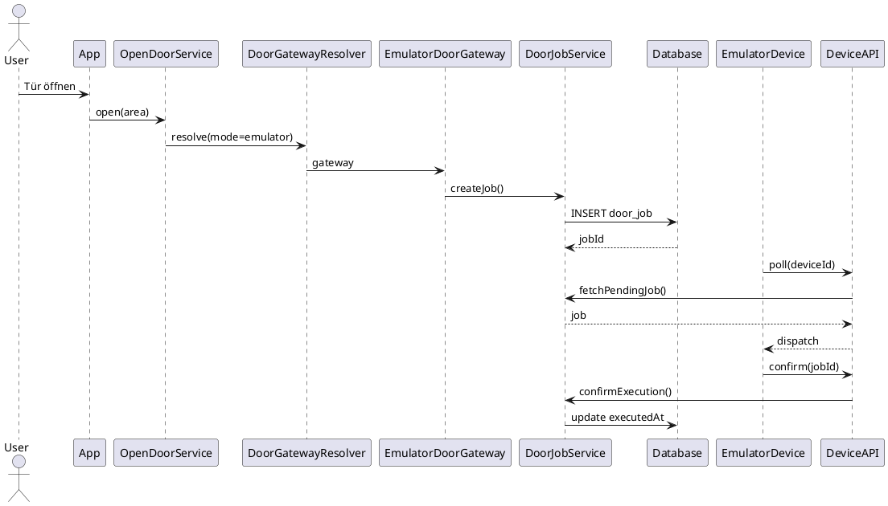

# Door Control Sequence Diagrams
Community Offers Bundle – Door Control Runtime Sequences

Dieses Dokument beschreibt den exakten Ablauf der Türöffnung
für alle unterstützten Betriebsmodi:

- live
- emulator

Die Diagramme sind in **PlantUML** dargestellt.

---

# Live Mode

Produktiver Betrieb mit realer Hardware.

Eigenschaften:

- Job wird erzeugt
- Raspberry Pi pollt
- Job wird dispatcht
- Confirm wird gesendet
- Tür öffnet physisch

## Sequence

---

# Emulator Mode

Workflow-Testmodus ohne reale Hardware.

Eigenschaften:

- identischer Ablauf wie live
- Emulator pollt statt Raspberry Pi
- keine physische Türöffnung

## Sequence

---

# Architekturhinweis

Die beiden Modi unterscheiden sich ausschließlich im verwendeten Gateway
und im Device-Typ.

| Mode     | Gateway                | Device Type        |
|----------|------------------------|--------------------|
| live     | RaspberryDoorGateway   | Raspberry Pi       |
| emulator | EmulatorDoorGateway    | Emulator Device    |

---

# Channel

Zusätzlich wird der Ausführungspfad gespeichert.

| Channel   | Beschreibung        |
|-----------|--------------------|
| physical  | reale Hardware      |
| emulator  | Emulator-Device     |

Zuordnung:

live → physical  
emulator → emulator  

---

# Datenmodell

DoorJobs speichern mindestens:

mode  
channel  
area  
correlationId  
expiresAt  

Beispiele:

Live:

mode = live  
channel = physical  

Emulator:

mode = emulator  
channel = emulator  
