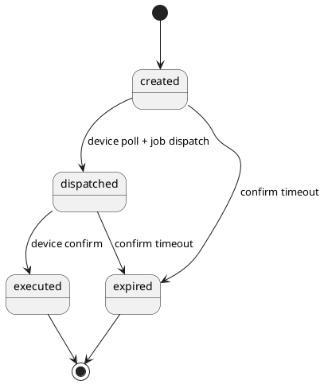

# Door Job State Machine
Community Offers Bundle – Door Workflow State Model

Dieses Dokument beschreibt die Zustandsmaschine (State Machine) eines DoorJobs.
Sie gilt für die Modi:

- live
- emulation

Im Modus **** wird kein DoorJob erzeugt.

---

# Überblick

Ein DoorJob durchläuft typischerweise folgende Zustände:

created → dispatched → executed

Optional können zusätzliche Zustände auftreten:

created → expired  
created → dispatched → expired

---

# State Machine Diagram (PlantUML)

---

# Zustände

## created

Der Job wurde erzeugt.

Typische Felder:

- createdAt
- expiresAt
- requestedByMemberId
- area
- correlationId
- mode
- channel

Der Job wartet darauf, von einem Device gepollt zu werden.

---

## dispatched

Der Job wurde an ein Device ausgeliefert.

Typische Felder:

- dispatchedAt
- dispatchToDeviceId

Bedeutung:

Ein Device hat den Job über den Poll-Endpunkt abgeholt.

---

## executed

Das Device hat die Ausführung bestätigt.

Typische Felder:

- executedAt
- resultCode
- resultMessage

Im Live-Modus bedeutet das:

Die reale Tür wurde geöffnet.

Im Emulation-Modus bedeutet das:

Der Emulator hat den Workflow bestätigt.

---

## expired

Der Job ist abgelaufen.

Das passiert wenn:

- kein Device pollt
- ein Device den Job nicht bestätigt

Typische Ursache:

- Device offline
- Netzwerkproblem
- Emulator nicht aktiv

---

# Mode Verhalten

| Mode | Job | Device |
|-----|-----|------|
| live | ja | Raspberry Pi |
| emulation | ja | Emulator |
|  | nein | kein Device |

---

# Channel

Der Channel beschreibt den technischen Ausführungspfad.

| Channel | Beschreibung |
|-------|-------------|
| physical | reale Hardware |
| emulator | Emulator Device |
| demo | direkte  (kein Job) |

---

# Typischer Live Ablauf

1. App sendet open request
2. DoorJob wird erzeugt
3. Raspberry Pi pollt Device API
4. Job wird dispatcht
5. Raspberry Pi sendet confirm
6. Job wird executed

---

# Typischer Emulation Ablauf

1. App sendet open request
2. DoorJob wird erzeugt
3. Emulator pollt Device API
4. Job wird dispatcht
5. Emulator sendet confirm
6. Job wird executed

## Door Job Status Lifecycle

pending
→ dispatched
→ executed

### Bedeutungen

pending  
Job erstellt, wartet auf Abholung durch Gerät.

dispatched  
Job wurde vom Gerät abgeholt.

executed  
Gerät hat Auftrag erfolgreich ausgeführt
(z. B. Tür entriegelt).

### Hinweis zur Benennung

Der API-Endpunkt `/api/device/confirm`
löst intern die Workflow-Transition `execute`
aus, die den Status auf `executed` setzt.
