# Community Offers Bundle

**Contao 5 Bundle** für *Zukunftwohnen*: Zugangssystem (Door/Areas) + API + Pull-Modell (Raspberry Pi) mit **confirmWindow = 30s**.  
Ziel: **sicher, nachvollziehbar, wartbar** – inkl. Diagrammen, Security-Model und Ops-Runbook.

---

## Schnellstart

<div style="display:grid;grid-template-columns:repeat(auto-fit,minmax(240px,1fr));gap:12px;margin:12px 0 18px;">
  <a href="developer-overview.md" style="display:block;border:1px solid rgba(255,255,255,.10);background:rgba(255,255,255,.03);border-radius:14px;padding:14px 14px 12px;text-decoration:none;color:inherit;">
    <div style="font-weight:700;font-size:15px;margin-bottom:6px;">Developer Overview</div>
    <div style="opacity:.85;font-size:13px;line-height:1.45;">Einstieg für Maintainer: Architektur, Services, wichtige Files & Workflows.</div>
  </a>

  <a href="api-door.md" style="display:block;border:1px solid rgba(255,255,255,.10);background:rgba(255,255,255,.03);border-radius:14px;padding:14px 14px 12px;text-decoration:none;color:inherit;">
    <div style="font-weight:700;font-size:15px;margin-bottom:6px;">API Door</div>
    <div style="opacity:.85;font-size:13px;line-height:1.45;">Endpoints & Contracts für Door/Open, Polling und Confirm.</div>
  </a>

  <a href="api-examples.md" style="display:block;border:1px solid rgba(255,255,255,.10);background:rgba(255,255,255,.03);border-radius:14px;padding:14px 14px 12px;text-decoration:none;color:inherit;">
    <div style="font-weight:700;font-size:15px;margin-bottom:6px;">API Examples</div>
    <div style="opacity:.85;font-size:13px;line-height:1.45;">Copy/Paste Beispiele (curl) für Tests & Debugging.</div>
  </a>

  <a href="security-model.md" style="display:block;border:1px solid rgba(255,255,255,.10);background:rgba(255,255,255,.03);border-radius:14px;padding:14px 14px 12px;text-decoration:none;color:inherit;">
    <div style="font-weight:700;font-size:15px;margin-bottom:6px;">Security Model</div>
    <div style="opacity:.85;font-size:13px;line-height:1.45;">Threats, Controls, confirmWindow, Audit, Hardening.</div>
  </a>

  <a href="ops-runbook.md" style="display:block;border:1px solid rgba(255,255,255,.10);background:rgba(255,255,255,.03);border-radius:14px;padding:14px 14px 12px;text-decoration:none;color:inherit;">
    <div style="font-weight:700;font-size:15px;margin-bottom:6px;">Ops Runbook</div>
    <div style="opacity:.85;font-size:13px;line-height:1.45;">Betrieb, Deploy, Troubleshooting, „was tun wenn…“.</div>
  </a>

  <a href="executive-summary.md" style="display:block;border:1px solid rgba(255,255,255,.10);background:rgba(255,255,255,.03);border-radius:14px;padding:14px 14px 12px;text-decoration:none;color:inherit;">
    <div style="font-weight:700;font-size:15px;margin-bottom:6px;">Executive Summary</div>
    <div style="opacity:.85;font-size:13px;line-height:1.45;">Kurzüberblick für Nicht-Dev Stakeholder.</div>
  </a>
</div>
---

## Systemüberblick

**Flow in einem Satz:**  
Client/App sendet **Open-Request** → API erzeugt **DoorJob** → Raspberry Pi **pollt** (Pull) → Bestätigung innerhalb **30s** → Pi steuert Hardware → Status & Audit werden persistiert.

**Wesentliche Konzepte**
- **Pull statt Push:** keine eingehenden Verbindungen zum Pi nötig
- **DoorJobService:** zentrale Business-Logik (Create/Confirm/Complete/Timeout)
- **Auditability:** jeder Statuswechsel ist nachvollziehbar (Jobs/Logs)
- **Security-by-design:** kurze Gültigkeit, klare Zustände, minimale Angriffsfläche

---

## Architekturdiagramm

<div style="border:1px solid rgba(255,255,255,.10);background:rgba(255,255,255,.02);border-radius:14px;padding:10px;overflow:auto;margin:12px 0;">
  
</div>

<div style="display:flex;flex-wrap:wrap;gap:8px;margin:8px 0 18px;">
  <a href="diagrams/generated/architecture.svg" download
     style="border:1px solid rgba(255,255,255,.12);background:rgba(255,255,255,.04);
            padding:6px 10px;border-radius:999px;font-size:12px;text-decoration:none;color:inherit;">
    SVG herunterladen
  </a>
  <a href="diagrams/generated/architecture.pdf"
     style="border:1px solid rgba(255,255,255,.12);background:rgba(255,255,255,.04);
            padding:6px 10px;border-radius:999px;font-size:12px;text-decoration:none;color:inherit;">
    PDF öffnen
  </a>
  <a href="diagrams/generated/architecture.png"
     style="border:1px solid rgba(255,255,255,.12);background:rgba(255,255,255,.04);
            padding:6px 10px;border-radius:999px;font-size:12px;text-decoration:none;color:inherit;">
    PNG öffnen
  </a>
</div>

## Warum Pull-Modell?

> Der Raspberry Pi baut **keine eingehende Verbindung** auf.  
> Er fragt aktiv nach neuen Jobs – das System bleibt dadurch einfacher und sicherer.

### Vorteile

- **Keine Portfreigaben nötig**  
  Keine eingehenden Verbindungen aus dem Internet ins lokale Netz.

- **Reduzierte Angriffsfläche**  
  API ist der einzige exponierte Bestandteil.

- **Robust gegen Netzwerkprobleme**  
  Wenn der Pi offline ist, werden Jobs später verarbeitet.

- **Klare Zustandslogik**  
  DoorJobs durchlaufen definierte States (created → confirmed → completed / timeout).

- **Zeitlich begrenzte Gültigkeit**  
  `confirmWindow = 30s` verhindert Replay- oder „hängende“ Open-Requests.

### Designprinzip

Das System folgt dem Prinzip:

> *„Der Aktor pollt, die API orchestriert, die Hardware führt aus.“*

Damit bleibt:
- die Business-Logik zentral
- die Hardware austauschbar
- das System auditierbar und wartbar

### DoorJob State Machine

| State | Bedeutung | Übergang |
|---|---|---|
| `pending` | Job wurde angelegt (Open-Request) | → `dispatched` oder `expired` |
| `dispatched` | Job wurde an ein Device ausgeliefert (Nonce erzeugt) | → `executed`, `failed` oder `expired` |
| `executed` | Tür erfolgreich geöffnet | Ende |
| `failed` | Hardware-/Ausführungsfehler | Ende |
| `expired` | Zeitfenster abgelaufen | Ende |

### Zustandsdiagramm

```mermaid
stateDiagram-v2
    [*] --> pending

    pending --> dispatched : Pi pollt\nJob wird ausgeliefert
    pending --> expired : expiresAt erreicht

    dispatched --> executed : confirm innerhalb confirmWindow
    dispatched --> failed : Hardware/IO Fehler
    dispatched --> expired : confirmWindow abgelaufen

    executed --> [*]
    failed --> [*]
    expired --> [*]


### Request Flow (Sequenz)

```mermaid
sequenceDiagram
  autonumber
  participant App as App/Client
  participant API as Symfony API (Contao Bundle)
  participant DB as DB (DoorJobs)
  participant Pi as Raspberry Pi (Pull)
  participant HW as Door Hardware

  App->>API: POST /api/door/open/{area}
  API->>DB: create DoorJob (state=created)
  API-->>App: jobId + confirmWindow

  loop Polling
    Pi->>API: GET /api/device/poll
    API->>DB: fetch next jobs for device
    API-->>Pi: job(s) (created/confirmed)
  end

  App->>API: POST /api/door/confirm/{jobId}
  API->>DB: set state=confirmed (expires in 30s)

  Pi->>API: GET /api/device/poll
  API-->>Pi: confirmed job

  Pi->>HW: trigger relay / open door
  Pi->>API: POST /api/device/complete/{jobId} (success/fail)
  API->>DB: set state=completed or failed

## Datenmodell

**Downloads:** [PDF](diagrams/generated/data-model.generated.pdf) · [PNG](diagrams/generated/data-model.generated.png) · [PUML](diagrams/generated/data-model.generated.puml)

---

## Dokumentation

### Architektur
- [Architecture Network](architecture-network.md)
- [Data Model](data-model.md)
- [Tracing & Observability](tracing-observability.md)
- [Ops Runbook](ops-runbook.md)

### Security
- [Security Model](security-model.md)

### CI & Release
- [CI and Release](ci-and-release.md)
- [Upgrade Plan](UPGRADE_PLAN.md)

---

## Maintainer-Checklist

1. **Überblick lesen:** [Developer Overview](developer-overview.md)  
2. **Door Flow verstehen:** [API Door](api-door.md) + [API Examples](api-examples.md)  
3. **Security prüfen:** [Security Model](security-model.md)  
4. **Betrieb sicherstellen:** [Ops Runbook](ops-runbook.md)

---

<sub>Hinweis: Die Diagramme werden aus `docs/diagrams/source/` nach `docs/diagrams/generated/` gebaut (Docker-only Pipeline).</sub>